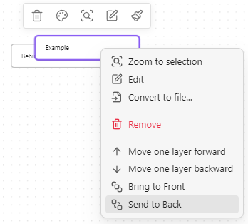

<h3 align="center">
    <picture>
        <source media="(prefers-color-scheme: dark)" srcset="https://raw.githubusercontent.com/Developer-Mike/obsidian-advanced-canvas/main/assets/logo-dark.png">
        
    </picture><br/><br/>
	Advanced Canvas for <a href="https://obsidian.md">Obsidian.md</a>
</h3>

<p align="center">
    <a href="https://github.com/Developer-Mike/obsidian-advanced-canvas/stargazers"></a>
    <a href="https://github.com/Developer-Mike/obsidian-advanced-canvas/issues"></a>
    <br/>
	<a href="https://obsidian.md/plugins?id=advanced-canvas"></a>
    <a href="https://raw.githubusercontent.com/Developer-Mike/obsidian-advanced-canvas/main/LICENSE"></a>
    <br/><br/>
    <b>⚡ Supercharge</b> your canvas experience! Create presentations, flowcharts and more!
</p>

## Installation
Open the Community Plugins tab in the settings and search for "Advanced Canvas" (or click [here](https://obsidian.md/plugins?id=advanced-canvas)).

<details>
    <summary>Other installation methods</summary>
    <br/>
    <ul>
        <li>Install it using <a href="https://github.com/TfTHacker/obsidian42-brat">BRAT</a></li>
        <li>Manual folder creation
            <ol>
                <li>Create a folder named <code>advanced-canvas</code> in your vault's plugins folder (<code>&lt;vault&gt;/.obsidian/plugins/</code>).</li>
                <li>Download <code>main.js</code>, <code>styles.css</code> and <code>manifest.json</code> from the latest release and put them in the <code>advanced-canvas</code> folder.</li>
                <li>Enable the plugin in Settings -> Community plugins -> Installed plugins</li>
            </ol>
        </li>
    </ul>
</details>

## Features
All features can be enabled/disabled in the settings.

- Expose node data to style them using CSS
- [Full Metadata Cache support](#full-metadata-cache-support)
  - See embedded files and links of the canvas in the **graph view**, **outgoing-links** and **backlinks**
- [Better default settings](#better-default-settings)
- More [canvas commands](#canvas-commands)
- [Node Styles](#node-styles)
  - (Flowchart) [Node Shapes](#node-shapes)
    - Terminal shape
    - Process shape
    - Decision shape
    - Input/Output shape
    - On-page Reference shape
    - Predefined Process shape
    - Document shape
    - Database shape
  - [Border Styles](#border-styles)
    - Dotted
    - Dashed
    - Invisible
  - Text Alignment
    - Left
    - Center
    - Right
- [Edge Styles](#edge-styles)
  - [Path Styles](#path-styles)
    - Dotted
    - Short-dashed
    - Long-dashed
  - [Arrow Styles](#arrow-styles)
    - Triangle Outline
    - Halved Triangle
    - Thin Triangle
    - Diamond
    - Diamond Outline
    - Circle
    - Circle Outline
  - [Pathfinding Methods](#pathfinding-methods)
    - Default
    - Straight
    - Square
    - A*
- Add [custom styles](#custom-styles) to nodes and edges for unlimited possibilities
- Add [per-node breakpoints](#variable-breakpoints) to change at which zoom factor the node's content gets unrendered
- [Z-Ordering control](#z-ordering-control) for nodes to control their stacking order
- [Custom colors](#custom-colors) in the color picker
- [Presentation mode](#presentation-mode)
  - Create presentations by connecting nodes with arrows
- [Portals](#portals)
  - Embed other canvases inside your canvas
  - Create edges (arrows) to the embedded canvas
- [Collapsible groups](#collapsible-groups)
  - Collapse and expand groups to organize your canvas
- Better [Image Export](#image-export)
  - Export the whole canvas or just a selection as an image
  - Export the canvas as an png/**svg** image with transparency
- [Auto node resizing](#auto-node-resizing)
  - Resize nodes automatically when the text content changes
- [Focus mode](#focus-mode)
  - Focus on a single node and blur all other nodes
- [Better readonly](#better-readonly)
  - Disable node popup menus
  - Lock the canvas' position
  - Lock the canvas' zoom
- [Floating edges](#floating-edges-automatic-edge-side) (Automatic Edge Side)
  - Change the side of the edge automatically to the most suitable side
- [Flip edge](#flip-edge)
  - Flip the direction of an edge with one click
- [Encapsulate selection](#encapsulate-selection)
  - Create a new canvas from the selected nodes
  - Create a link to the new canvas in the current canvas
- Create groups independently of the nodes
- Expose [canvas events](#canvas-events) to use them in other plugins

## Support
Please consider supporting the plugin. There are many hours of work and effort behind it. The two easiest ways to support the plugin are either by starring ⭐ the repository or by donating any amount on [Ko-fi](https://ko-fi.com/X8X27IA08) ❤️. Thank you!

[](https://ko-fi.com/X8X27IA08)


## Full Metadata Cache Support
Advanced Canvas enables .canvas files to be indexed by the metadata cache. This means that there is now full compatibility with the graph view, outgoing links and backlinks. You can even enable (optional) the creation of an outgoing link if two embeds in a canvas are connected by an edge. This feature brings the full power of Obsidian's linking system to the canvas file format.

<details>
    <summary>Metadata Cache Support Example</summary>
    
</details>

<details>
    <summary>Outgoing Link Using An Edge Example</summary>
    
</details>

### Technical Details
- The file cache of a .canvas file now contains a value for the hash key (Generated from the filepath) instead of an empty string
  - Check the `app.metadataCache.fileCache[<filepath>]` object to see the changes
- The metadata cache is located in the `app.metadataCache` object - the same object that is used by Obsidian for markdown files
  - e.g. `app.metadataCache.getCache`/`app.metadataCache.getFileCache` now works with .canvas files
  - The `position` object which is found inside metadata cache entries now contains a new key `nodeId` for .canvas files
  - The metadata cache entry for a .canvas file now contains a new key `nodes` which is an object of type `{ [nodeId: string]: MetadataCacheEntry }` - this allows for other plugins to access the full metadata cache for single nodes. The `MetadataCacheEntry` object is the same as for markdown files (even created with the same function - 1:1 compatibility)
- The resolved links object now has entries for .canvas files
  - The `app.metadataCache.resolvedLinks` object values for .canvas files are implemented in the exact same way as for markdown files

## Better Default Settings
- Enforce all new nodes to be aligned to the grid
- Customize default text node size
- Customize default file node size
- Modify the minimum node size
- Disable the font scaling relative to the zoom level

## Canvas Commands
- `Advanced Canvas: Open Quicksettings`
  - Open the quicksettings menu
- `Advanced Canvas: Create text node`
  - Create a new text node
- `Advanced Canvas: Create file node`
  - Create a new file node
- `Advanced Canvas: Select all edges`
  - Select all edges
- `Advanced Canvas: Zoom to selection`
  - Zoom to the bounding box of the selected nodes
- `Advanced Canvas: Zoom to fit`
  - Zoom to fit all nodes
- `Advanced Canvas: Clone node up/down/left/right`
  - Clone the selected node in the direction of the arrow keys
  - The cloned node will have the same dimensions and color as the original node
- `Advanced Canvas: Expand node up/down/left/right`
  - Expand the selected node in the direction of the arrow keys
- `Advanced Canvas: Flip selection horizontally/vertically`
  - Flip the selected nodes and the respective edges horizontally or vertically

## Node Styles
You can customize the default node styles using the settings.

### Node Shapes
<details>
    <summary>Flowchart Example</summary>
    
</details>

#### Usage
- Use the updated popup menu set a node's shape

#### Shapes
<details>
    <summary>Terminal Shape</summary>
    
</details>

<details>
    <summary>Process/Center Shape</summary>
    
</details>

<details>
    <summary>Decision Shape</summary>
    
</details>

<details>
    <summary>Input/Output Shape</summary>
    
</details>

<details>
    <summary>On-page Reference Shape</summary>
    
</details>

<details>
    <summary>Predefined Process Shape</summary>
    
</details>

<details>
    <summary>Document Shape</summary>
    
</details>

<details>
    <summary>Database Shape</summary>
    
</details>

### Border Styles
Set the style of the border to dotted, dashed or invisible.

<details>
    <summary>Border Styles Example</summary>
    
</details>

## Edge Styles
You can customize the default edge styles using the settings.

### Path Styles
Set the style of the edge paths to dotted, short-dashed or long-dashed.

<details>
    <summary>Edge Styles Example</summary>
    
</details>

### Arrow Styles
Set the style of the arrows to triangle outline, halved triangle, thin triangle, diamond, diamond outline, circle or circle outline.

<details>
    <summary>Arrow Styles Example</summary>
    
</details>

### Pathfinding Methods
Set the pathfinding method of the edges (arrows) to default, straight, squared or A*.

<details>
    <summary>Path Styles Example</summary>
    
</details>

## Custom Styles
Custom style attributes for nodes and edges can easily be added.

1. Create a new CSS snippet in your vault
   - To do this, navigate to `Settings > Appearance > *scroll down* > CSS snippets` and click on the folder icon to open the snippets folder
   - Create a new CSS file (e.g. `my-fancy-node-style.css`)
2. Add the custom style attribute
   - Open the CSS file and add the following code and replace the values how you like. The format needs to be **YAML** and needs to contain the same keys as in this example. The amount of options can be adjusted as needed (minimum of one option is required). The `icon` key should contain the id of the icon you want to use. You can find the icons on [lucide.dev](https://lucide.dev/icons/)
   - Change the `@advanced-canvas-node-style` to `@advanced-canvas-edge-style` if you want to add a custom style attribute for edges
    ```css
    /* @advanced-canvas-node-style
    key: validation-state
    label: Validation State
    options: 
      - 
        label: Stateless
        value: null
        icon: circle-help

      - 
        label: Approved
        value: approved
        icon: circle-check

      - 
        label: Pending
        value: pending
        icon: circle-dot

      - 
        label: Rejected
        value: rejected
        icon: circle-x
    */
    ```

> [!IMPORTANT]
> There needs to be **one** option with the value null

3. Add the CSS styling
   - In the same (or another) CSS file, add the styling for the custom style attribute
    ```css
    .canvas-node[data-<YOUR-CUSTOM-STYLE-KEY>="<VALUE>"] {
      /* Your custom styling */
    }
    ```
    in **my** case:
    ```css
    .canvas-node[data-validation-state] .canvas-node-content::after {
      content: "";

      position: absolute;
      top: 10px;
      right: 10px;

      font-size: 1em;
    }

    .canvas-node[data-validation-state="approved"] .canvas-node-content::after {
      content: "✔️";
    }

    .canvas-node[data-validation-state="pending"] .canvas-node-content::after {
      content: "⏳";
    }

    .canvas-node[data-validation-state="rejected"] .canvas-node-content::after {
      content: "❌";
    }
    ```
4. **Enable** the CSS snippet in the settings and enjoy your new custom style attribute!
    <br>

**Take a look at the whole file [here](https://raw.githubusercontent.com/Developer-Mike/obsidian-advanced-canvas/main/assets/example-custom-node-style.css)**

## Variable Breakpoints
Add breakpoints to nodes to change at which zoom factor the node's content gets unrendered.

Create a new CSS snippet in your vault (And enable it in the settings)
```css	
/* Any CSS selector can be used (As long as the .canvas-node element has the CSS variable defined) */
.canvas-node[data-shape="pill"] {
    /* The zoom factor at which the node's content gets unrendered (Zoom level can reach from 1 to -4) */
    --variable-breakpoint: 0.5;
}
```

## Z-Ordering Control
Change z-ordering of nodes using the context menu.

<details>
    <summary>Z-Ordering Control Example</summary>
    
</details>

## Custom Colors
Add custom colors to the color picker. You can add them using the following css snippet:
```css
body {
    /* Where X is the index of the color in the palette */
    /* The colors 1-6 are already used by Obsidian */
    --canvas-color-X: 0, 255, 0; /* RGB */
}
```

<details>
    <summary>Custom Colors In Palette</summary>
    
</details>

## Presentation Mode
In presentation mode, you can navigate through the nodes using the arrow keys or the PageUp/PageDown keys (Compatible with most presentation remotes). The different slides/nodes are connected using arrows. If you want to have multiple arrows pointing from the same node, you can number them in the order you want to navigate through them. While in presentation mode, the canvas is in readonly mode (So [better readonly](#better-readonly) effects the presentation mode as well!). You can exit the presentation mode using the `ESC` key or the corresponding command. If you want to continue the presentation from the last slide you were on, you can use the `Advanced Canvas: Continue presentation` command.


<details>
    <summary>Canvas File</summary>
    
</details>

### More Complex Example


<details>
    <summary>Canvas File</summary>
    
</details>

### Usage
- Create the first slide
  - Create the first slide of the presentation using the updated popup menu
  - OR create a node and mark it as the first slide using the updated card menu
- Add more slides
  - Link the slides using arrows
    - If you want to loop back to a previous slide, you can number the arrows in the order you want to navigate through them
  - <b>TIP:</b> Create slides with consistent dimensions by using the updated card menu
- Control the presentation
  - Start the presentation using the command palette (`Advanced Canvas: Start presentation`)
  - Change slides using the arrow keys
  - Exit the presentation using the `ESC` key

## Portals
Embed other canvases inside your canvas and create edges (arrows) to the embedded canvas.


### Usage
- Embed a canvas file and click on the door icon of the popup menu to open a portal

## Collapsible Groups
Collapse and expand groups to organize your canvas.

<details>
    <summary>Collapsible Groups Example</summary>
    
</details>

## Image Export
Export the whole canvas/your selection as an png/svg image with transparency. Export options from the core plugin are also available - this includes "Privacy Mode" and "Show Logo" (Logo got extended to include Advanced Canvas).

<details>
    <summary>Image Export Example</summary>
    
</details>

## Auto Node Resizing
Resize nodes automatically when the text content changes. Toggle this feature on a per-node basis using the updated popup menu.

<details>
    <summary>Auto Node Resizing Example</summary>
    
</details>

## Focus Mode
Focus on a single node and blur all other nodes.

<details>
    <summary>Focus Mode Example</summary>
    
</details>

## Better Readonly
- Disable node popup menus
- Lock the canvas' position
- Lock the canvas' zoom
- BUT to retain some interactivity, it allows zooming to a bounding box (e.g. zoom to selection, zoom to fit all)

### Usage
- Use the updated control menu to toggle the new features (Only shown if the canvas is in readonly mode)

## Encapsulate Selection
Move the current selection to a new canvas and create a link in the current canvas.

### Usage
- Select the nodes you want to encapsulate
- Use the context menu (right click) to encapsulate the selection
- OR use the command palette (`Advanced Canvas: Encapsulate selection`)

## Floating Edges (Automatic Edge Side)
Change the side of the edge automatically to the most suitable side.
Drag the edge to the indicated drop zone inside the node to make the edge float.

<details>
    <summary>Floating Edges Example</summary>
    
</details>

## Flip Edge
Flip the direction of an edge with one click.

<details>
    <summary>Flip Edge Example</summary>
    
</details>

## Canvas Events
All custom events are prefixed with `advanced-canvas:` and can be listened to using `app.workspace.on` (Just like the default events).
Check out the list of events [here](https://github.com/Developer-Mike/obsidian-advanced-canvas/blob/main/src/events.ts).

## Settings
Every feature can be enabled/disabled in the settings. All features were made to be as customizable as possible.

## Contributing
All code contributions are welcome! (PRs that only update the documentation won't get merged. Please open an issue instead.)
You may want to check out issues with the `PRs appreciated` label to find issues you can start with.
But feel free to work on any issue or non-issue you want to work on!

## Star History

