<h3 align="center">
	  
	Advanced Canvas for <a href="https://obsidian.md">Obsidian.md</a>
</h3>

    
    
    
     
    
      
    <b>⚡ Supercharge</b> your canvas experience! Create presentations, flowcharts and more!

## Installation (waiting for approval for the community plugins list)
- Create a folder named `advanced-canvas` in your vault's plugins folder (`<vault>/.obsidian/plugins/`).
- Download `main.js`, `styles.css` and `manifest.json` from the latest release and put them in the `advanced-canvas` folder.
- Enable the plugin in Settings -> Community plugins -> Installed plugins

## Features
- Create groups independently of the nodes ([Updated card menu](#updated-canvas-card-menu))
- [Flowchart](#flowchart) shapes
  - Process shape
  - Terminal shape
  - Decision shape
  - Input/Output shape
  - On-page Reference shape
  - Predefined Process shape
  - Document shape
  - Database shape
- [Presentation mode](#presentation)
  - Create presentations by connecting nodes with arrows

## Updated Canvas Card Menu
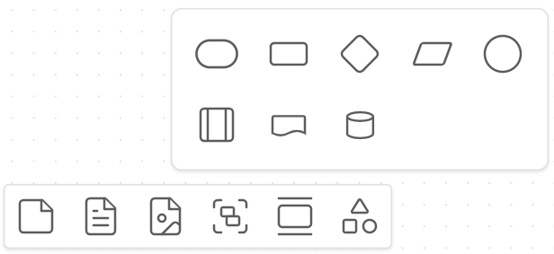

## Flowchart

    
Flowchart Example

    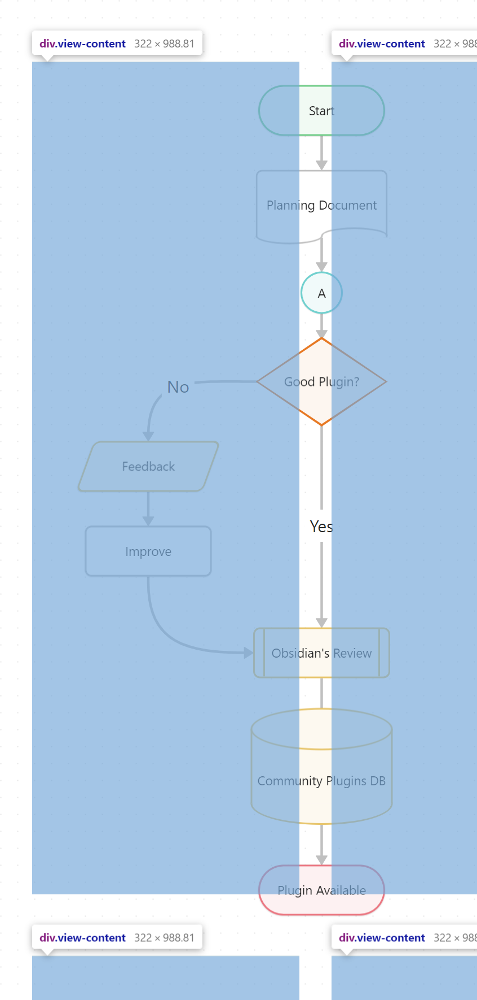

### Usage
- Use the [updated card menu](#updated-canvas-card-menu) to create flowchart nodes
- OR alter the node type by adding a comment at the beginning or end of the node (e.g. `%%process%%`)
  - Look up the aliases in the [code file](./src/canvas-extensions/flowchart-canvas-extension.ts)

### Shapes

    
Process Shape

    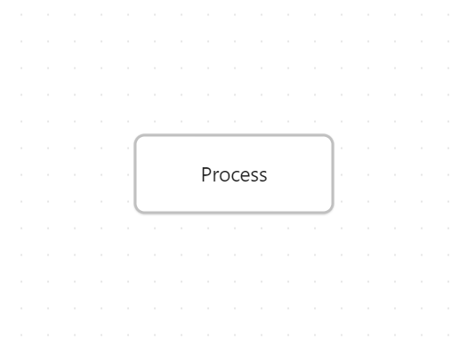

    
Terminal Shape

    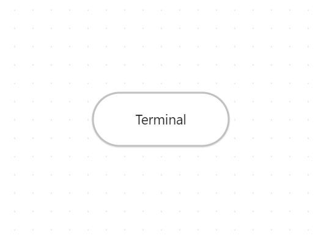

    
Decision Shape

    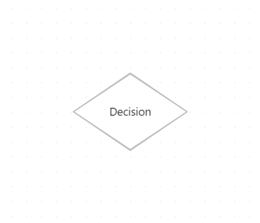

    
Input/Output Shape

    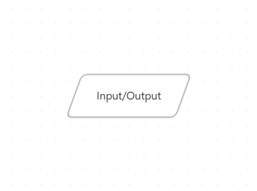

    
On-page Reference Shape

    

    
Predefined Process Shape

    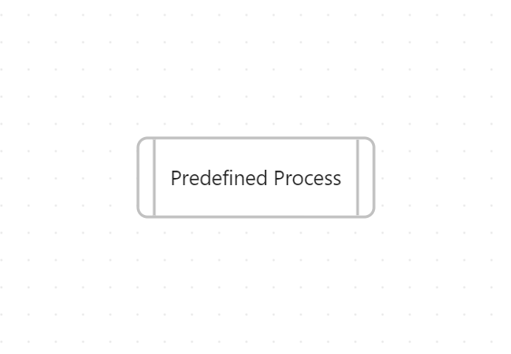

    
Document Shape

    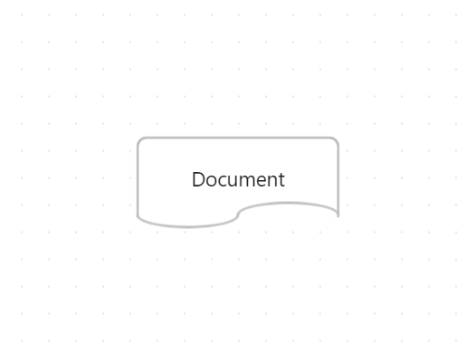

    
Database Shape

    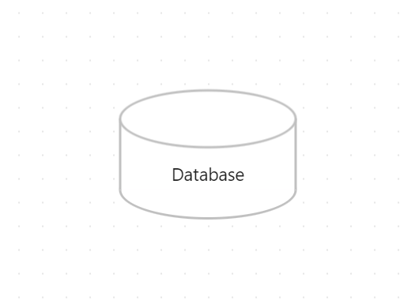

## Presentation Mode
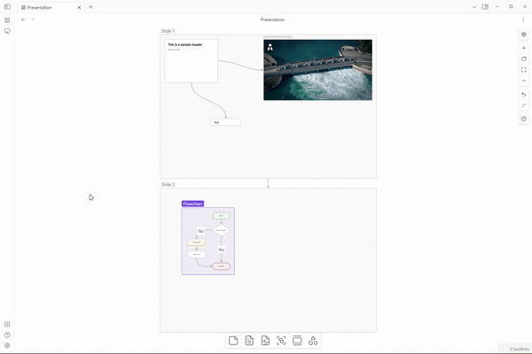

    
Canvas File

    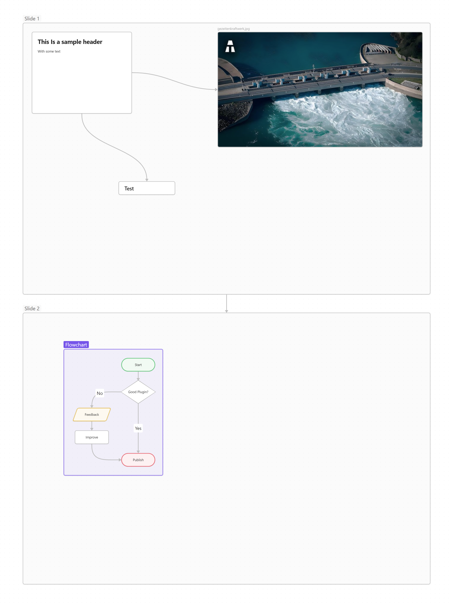

### More Complex Example
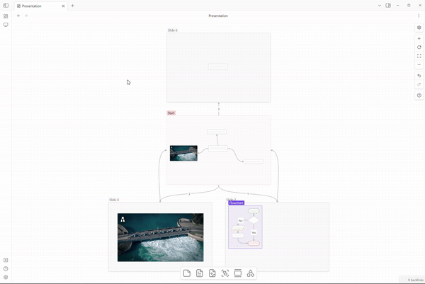

    
Canvas File

    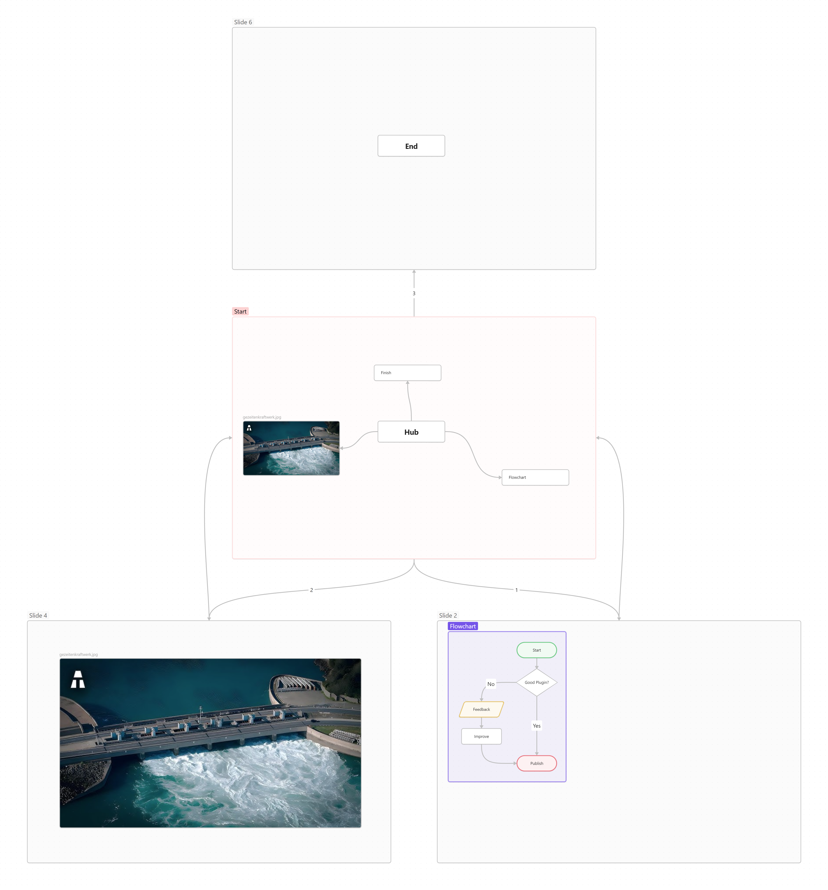

### Usage
- Create the first slide
  - Create the first slide of the presentation using the [updated card menu](#updated-canvas-card-menu)
  - OR create a group and name it `Start` (case sensitive)
- Add more slides
  - Link the slides using arrows
    - If you want to loop back to a previous slide, you can number the arrows in the order you want to navigate through them
  - <b>TIP:</b> Create slides with consistent dimensions by using the [updated card menu](#updated-canvas-card-menu)
- Control the presentation
  - Start the presentation using the command palette (`Advanced Canvas: Start presentation`)
  - Change slides using the arrow keys
  - Exit the presentation using the `ESC` key

## Settings
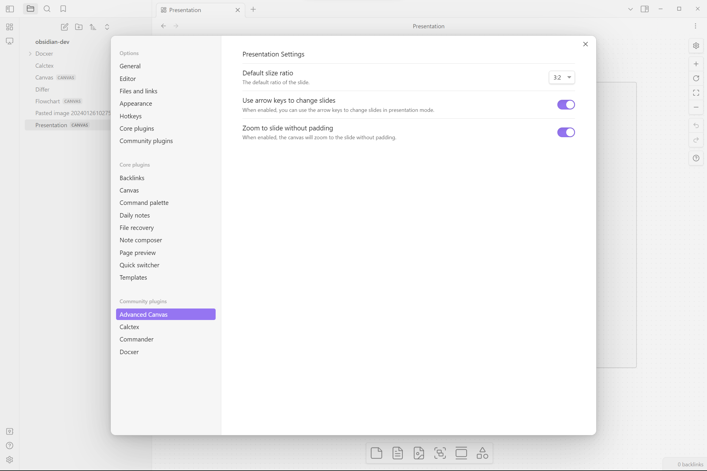

## Planned Features
- [ ] New presentation slides should be created without intersecting the existing ones
- [ ] Fix the document flowchart node (looks sketchy right now)
- [ ] Clean up flowchart node icons and css
- [x] Add better presentation mode navigation (Looping back to previous slides)
- [x] Add more flowchart shapes

## Known Issues
- None so far 👀 - Create an issue if you find any!