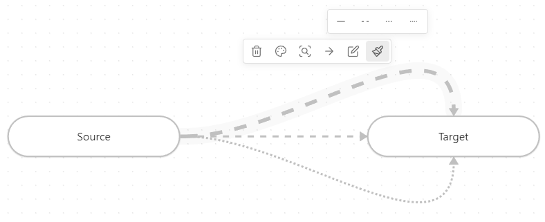

<h3 align="center">
    <picture>
        <source media="(prefers-color-scheme: dark)" srcset="./assets/logo-dark.svg">
        
    </picture><br/><br/>
	Advanced Canvas for <a href="https://obsidian.md">Obsidian.md</a>
</h3>

<p align="center">
    <a href="https://github.com/Developer-Mike/obsidian-advanced-canvas/stargazers"></a>
    <a href="https://github.com/Developer-Mike/obsidian-advanced-canvas/issues"></a>
    <a href="https://github.com/Developer-Mike/obsidian-advanced-canvas/contributors"></a>
    <br/>
	<a href="https://obsidian.md/plugins?id=advanced-canvas"></a>
    <a href="./LICENSE"></a>
    <br/><br/>
    <b>⚡ Supercharge</b> your canvas experience! Create presentations, flowcharts and more!
</p>

## Installation
Recommended:
- Open the Community Plugins tab in the settings and search for "Advanced Canvas"

OR
- Install it using [BRAT](https://github.com/TfTHacker/obsidian42-brat)

OR
- Create a folder named `advanced-canvas` in your vault's plugins folder (`<vault>/.obsidian/plugins/`).
- Download `main.js`, `styles.css` and `manifest.json` from the latest release and put them in the `advanced-canvas` folder.
- Enable the plugin in Settings -> Community plugins -> Installed plugins

## Features
All features can be enabled/disabled in the settings.

- Create groups independently of the nodes ([Updated card menu](#updated-canvas-card-menu))
- More [canvas commands](#canvas-commands)
- (Flowchart) [Node shapes](#node-shapes)
  - Terminal shape
  - Process shape
  - Decision shape
  - Input/Output shape
  - On-page Reference shape
  - Predefined Process shape
  - Document shape
  - Database shape
- [Edge Styles](#edge-styles)
  - Edge styles
    - Dotted
    - Short-dashed
    - Long-dashed
  - Path styles
    - Default
    - Straight
    - A*
- [Custom colors](#custom-colors) in the color picker
- [Stickers](#stickers)
  - Convert image nodes to stickers (transparent background and no border)
- [Presentation mode](#presentation)
  - Create presentations by connecting nodes with arrows
- [Portals](#portals)
  - Embed other canvases inside your canvas
  - Create edges (arrows) to the embedded canvas
- [Collapsible groups](#collapsible-groups)
  - Collapse and expand groups to organize your canvas
- [Better readonly](#better-readonly)
  - Disable node popup menus
  - Lock the canvas' position
  - Lock the canvas' zoom
- [Encapsulate selection](#encapsulate-selection)
  - Create a new canvas from the selected nodes
  - Create a link to the new canvas in the current canvas
- Expose [canvas events](#canvas-events) to use them in other plugins
- Expose node data to style them using CSS

## Support
If you want to support me and my work, consider starring ⭐ the repository, or, if you want to support me financially, you can donate any amount on [Ko-fi](https://ko-fi.com/X8X27IA08) ❤️

[](https://ko-fi.com/X8X27IA08)

## Updated UI
### Canvas Card Menu
<details>
    <summary>Canvas Card Menu</summary>
    
</details>

### Node Popup Menu
<details>
    <summary>Node Popup Menu</summary>
    
</details>

### Canvas Control Menu
<details>
    <summary>Canvas Control Menu</summary>
    
</details>

## Canvas Commands
- `Advanced Canvas: Create text node`
  - Create a new text node
- `Advanced Canvas: Create file node`
  - Create a new file node
- `Advanced Canvas: Zoom to selection`
  - Zoom to the bounding box of the selected nodes
- `Advanced Canvas: Clone node up/down/left/right`
  - Clone the selected node in the direction of the arrow keys
  - The cloned node will have the same dimensions and color as the original node
- `Advanced Canvas: Expand node up/down/left/right`
  - Expand the selected node in the direction of the arrow keys

## Node Shapes
<details>
    <summary>Flowchart Example</summary>
    
</details>

### Usage
- Use the [updated popup menu](#node-popup-menu) set a node's shape

### Shapes
<details>
    <summary>Terminal Shape</summary>
    
</details>

<details>
    <summary>Process/Center Shape</summary>
    
</details>

<details>
    <summary>Decision Shape</summary>
    
</details>

<details>
    <summary>Input/Output Shape</summary>
    
</details>

<details>
    <summary>On-page Reference Shape</summary>
    
</details>

<details>
    <summary>Predefined Process Shape</summary>
    
</details>

<details>
    <summary>Document Shape</summary>
    
</details>

<details>
    <summary>Database Shape</summary>
    
</details>

## Edge Styles
### Edge Styles
Set the style of the edges (arrows) to dotted, short-dashed or long-dashed.

<details>
    <summary>Edge Styles Example</summary>
    
</details>

### Path Styles
Set the path style of the edges (arrows) to default, straight or A*.

<details>
    <summary>Path Styles Example</summary>
    
</details>

## Custom Colors
Add custom colors to the color picker. You can add them using the following css snippet:
```css
:root {
    /* Where X is the index of the color in the palette */
    /* The colors 1-6 are already used by Obsidian */
    --canvas-color-X: 0, 255, 0; /* RGB */
}
```

<details>
    <summary>Custom Colors In Palette</summary>
    
</details>

## Stickers
Convert image nodes to stickers. Stickers have a transparent background and no border.

<details>
    <summary>Sticker Example</summary>
    
</details>

## Presentation Mode
In presentation mode, you can navigate through the nodes using the arrow keys. The different slides/nodes are connected using arrows. If you want to have multiple arrows pointing from the same node, you can number them in the order you want to navigate through them. While in presentation mode, the canvas is in readonly mode (So [better readonly](#better-readonly) effects the presentation mode as well!). You can exit the presentation mode using the `ESC` key.


<details>
    <summary>Canvas File</summary>
    
</details>

### More Complex Example


<details>
    <summary>Canvas File</summary>
    
</details>

### Usage
- Create the first slide
  - Create the first slide of the presentation using the [updated popup menu](#node-popup-menu)
  - OR create a node and mark it as the first slide using the [updated card menu](#canvas-card-menu)
- Add more slides
  - Link the slides using arrows
    - If you want to loop back to a previous slide, you can number the arrows in the order you want to navigate through them
  - <b>TIP:</b> Create slides with consistent dimensions by using the [updated card menu](#canvas-card-menu)
- Control the presentation
  - Start the presentation using the command palette (`Advanced Canvas: Start presentation`)
  - Change slides using the arrow keys
  - Exit the presentation using the `ESC` key

## Portals
Embed other canvases inside your canvas and create edges (arrows) to the embedded canvas.


### Usage
- Embed a canvas file and click on the door icon of the popup menu to open a portal

## Collapsible Groups
Collapse and expand groups to organize your canvas.

<details>
    <summary>Collapsible Groups Example</summary>
    
</details>

## Better Readonly
- Disable node popup menus
- Lock the canvas' position
- Lock the canvas' zoom
- BUT to retain some interactivity, it allows zooming to a bounding box (e.g. zoom to selection, zoom to fit all)

### Usage
- Use the [updated control menu](#canvas-control-menu) to toggle the new features (Only shown if the canvas is in readonly mode)

## Encapsulate Selection
Move the current selection to a new canvas and create a link in the current canvas.

### Usage
- Select the nodes you want to encapsulate
- Use the context menu (right click) to encapsulate the selection
- OR use the command palette (`Advanced Canvas: Encapsulate selection`)

## Canvas Events
All custom events are prefixed with `advanced-canvas:` and can be listened to using `app.workspace.on` (Just like the default events).

<details>
    <summary>
        All Events (27)
    </summary>

  - `advanced-canvas:canvas-changed`
    - Fired when a new canvas gets loaded
    - Payload: `Canvas`
  - `advanced-canvas:viewport-changed:before` and `advanced-canvas:viewport-changed:after`
    - Fired before and after the viewport gets changed
    - Payload: `Canvas`
  - `advanced-canvas:node-moved`
    - Fired when a node gets moved
    - Payload: `Canvas`, `Node`
  - `advanced-canvas:double-click`
    - Fired when the canvas gets double-clicked
    - Payload: `Canvas`, `MouseEvent`, `preventDefault: { value: Boolean }`
  - `advanced-canvas:dragging-state-changed`
    - Fired when the dragging state of the canvas changes
    - Payload: `Canvas`, `boolean`
  - `advanced-canvas:node-added`
    - Fired when a new node gets added
    - Payload: `Canvas`, `Node`
  - `advanced-canvas:edge-added`
    - Fired when a new edge gets added
    - Payload: `Canvas`, `Edge`
  - `advanced-canvas:node-removed`
    - Fired when a node gets removed
    - Payload: `Canvas`, `Node`
  - `advanced-canvas:edge-removed`
    - Fired when an edge gets removed
    - Payload: `Canvas`, `Edge`
  - `advanced-canvas:node-changed`
    - Fired when any node gets changed
    - Payload: `Canvas`, `Node`
  - `advanced-canvas:edge-changed`
    - Fired when any edge gets changed
    - Payload: `Canvas`, `Edge`
  - `advanced-canvas:node-bbox-requested`
    - Fired when the bounding box of a node gets requested (e.g. for the edge path or when dragging a group)
    - Payload: `Canvas`, `Node`, `BBox (Reference!)`
  - `advanced-canvas:edge-center-requested`
    - Fired when the center of an edge gets requested (e.g. for the edge label position)
    - Payload: `Canvas`, `Edge`, `Position (Reference!)`
  - `advanced-canvas:containing-nodes-requested`
    - Fired when the nodes inside a bounding box get requested
    - Payload: `Canvas`, `BBox`, `Node[] (Reference!)`
  - `advanced-canvas:selection-changed`
    - Fired when the selection of the canvas changes
    - Payload: `Canvas`, `oldSelection: Set<Node|Edge>`, `updateSelection: (() => void) => void`
  - `advanced-canvas:zoom-to-bbox:before` and `advanced-canvas:zoom-to-bbox:after`
    - Fired before and after the canvas gets zoomed to a bounding box (e.g. zoom to selection, zoom to fit all)
    - Payload: `Canvas`, `BBox`
  - `advanced-canvas:popup-menu-created`
    - Fired when the a node popup menu gets created (Not firing multiple times if it gets moved between nodes of the same type)
    - Payload: `Canvas`
  - `advanced-canvas:node-interaction`
    - Fired when a node gets hovered over
    - Payload: `Canvas`, `Node`
  - `advanced-canvas:undo`
    - Fired when undo gets called
    - Payload: `Canvas`
  - `advanced-canvas:redo`
    - Fired when redo gets called
    - Payload: `Canvas`
  - `advanced-canvas:readonly-changed`
    - Fired when the readonly state of the canvas changes
    - Payload: `Canvas`, `boolean`
  - `advanced-canvas:data-requested`
    - Fired when the canvas data gets requested
    - Payload: `Canvas`, `CanvasData (Reference!)`
  - `advanced-canvas:load-data`
    - Fired when the canvas data gets set
    - Payload: `Canvas`, `CanvasData (Reference!)`, `setData: (CanvasData) => void`
  - `advanced-canvas:canvas-saved:before` and `advanced-canvas:canvas-saved:after`
    - Fired before and after the canvas gets saved
    - Payload: `Canvas`
</details>

## Settings
Every feature can be enabled/disabled in the settings. All features were made to be as customizable as possible.

## Contributing
All contributions are welcome! Here's how you can help:
- Create a fork of the repository
- Create a branch with a descriptive name
- Make your changes
- Debug the plugin using `npm run dev`
- Create a pull request
- Wait for the review

## Known Issues - Create an issue if you find any!
- [ ] Shapes are not shown in the preview
- [ ] Edges from portals can still be dragged
